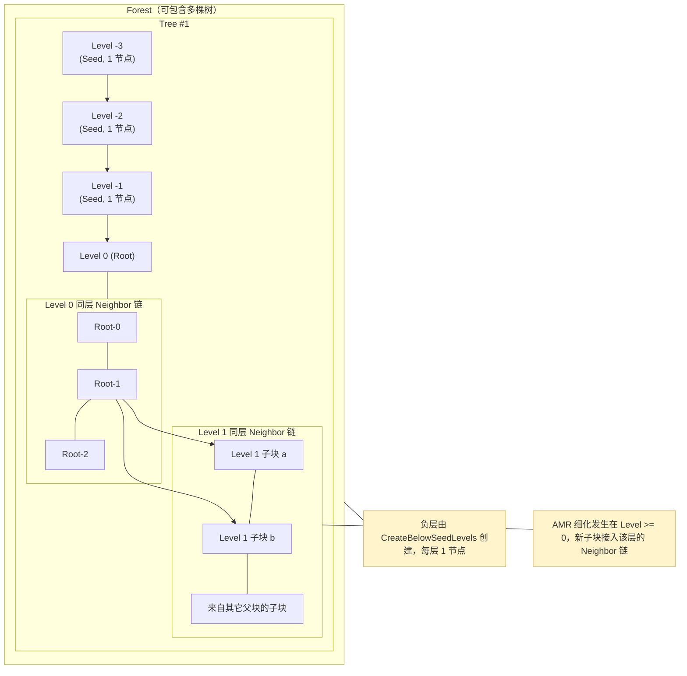

# BSAM 2.0 中文总览与端到端流程

> Block-Structured Adaptive Multigrid (BSAM) 求解框架：块结构自适应网格 + 多重网格（AFAS）迭代。

本文件用通俗语言梳理“程序从启动到结束”做了什么、关键模块各自负责什么、以及“根之上负层（种子层）”存在的意义。

---

## 目录
- 项目结构与主入口
- 可视化图示
- 关键模块职责速览
- 从头到尾：一次运行的完整流程
- AMR 自适应 vs. 多重网格粗层（负层）的区别
- 树结构（TreeOps）一分钟上手
- 常见问题 FAQ
- 重要回调与数据文件

---

## 可视化图示

下面两张图分别展示：

- 结构图：森林/树/层级/同层邻接（Neighbor）关系，以及“根之上负层（种子层）”和“根之下 AMR 子层”的统一表示。
- 流程图：程序从 BSAMDriver 启动到结束的关键步骤，以及 AMR 与 AFAS 多重网格在时间推进中的位置。

图 1｜结构示意（Forest / Tree / Level / Neighbor）



图 2｜端到端流程（从输入到求解与输出）

```mermaid
flowchart TD
  Start(["Start: BSAMDriver"]) --> Read["读取 rundata.dat"]
  Read --> InitForest["InitForest 创建森林与 Root"]
  InitForest --> RootInit["ApplyOnLevel(0, RootInit)"]
  RootInit --> CreateSeeds["CreateBelowSeedLevels(minlevel)"]
  CreateSeeds --> InitNeg["对每个负层 ApplyOnLevel(ilevel, InitSeed)"]
  InitNeg --> Setup["SetupProblem/初始化场或重启读取"]
  Setup --> FrameLoop{"帧循环 outframes"}
  FrameLoop -->|每帧| StepLoop{"步循环 frameSteps"}
  StepLoop --> Mark["标记非活动节点"]
  Mark --> AMR["AMR 重构层级"]
  AMR --> Release["释放旧字段 / 删除节点"]
  Release --> FillDown{"首帧且首次 AMR? "]
  FillDown -->|是| DoFill["FillDown(solutionfield)"]
  FillDown -->|否| SkipFill["跳过"]
  DoFill --> CopyQ
  SkipFill --> CopyQ
  CopyQ["CopyQToQold"] --> MG["MultigridIterations (AFAS)"]
  MG --> Update["更新时间/统计"]
  Update --> SetTime["ApplyOnLevel(所有层, SetCurrentTime)"]
  SetTime --> Output{"达到该帧输出点?"}
  Output -->|是| Write["WriteQ / WriteUniformMeshQ"]
  Output -->|否| NoWrite["继续"]
  Write --> NextStep["下一步或下一帧"]
  NoWrite --> NextStep
  NextStep -->|继续| StepLoop
  StepLoop -->|帧完成| FrameLoop
  FrameLoop -->|全部帧完成| End(["End: AfterRun / KillForest"])
```

---

## 项目结构与主入口

- 主程序入口：`Fortran/LIBRARY/bsamdriver.f90`
  - `PROGRAM BSAMDriver` 里只做两件事：计时 + 调用 `BSAMRoutines::BSAMSolver`。
- 调度核心：`Fortran/LIBRARY/bsamroutines.f90`
  - `SUBROUTINE BSAMSolver` 是全局驱动，组织初始化、时间推进、AMR 与多重网格迭代、输出与清理。
- 树与遍历：`Fortran/LIBRARY/treeops.f90`
  - 提供森林/树/节点的数据结构与遍历函数（ApplyOnLevel/Leaves/Forest 等），以及在根之上创建“负层/种子层”的工具。
- 物理问题与 IO/存储等其他模块：
  - `nodeinfodef.f90` 定义节点信息 `nodeinfo`、全局常量（如 `rootlevel`, `MaxDepth`）等；
  - `bsaminputoutput.f90` 读写解（`ReadQ/WriteQ/WriteUniformMeshQ`）；
  - `bsamstorage.f90` 分配/释放字段存储；
  - `boundary.f90` 边界与 ghost 单元；
  - `afasroutines.f90` 多重网格（AFAS）迭代；
  - `PROBLEM/.../problem*.f90` 用户问题定义（初始化、源项等）。

---

## 关键模块职责速览

- BSAMRoutines
  - BSAMSolver：全流程调度
  - TakeTimeSteps：按帧/步推进时间，驱动 AMR 与 AFAS 多重网格
  - AMR：构建新网格层级，标记、生成新子网格、转移场数据，删除旧网格
- TreeOps
  - InitForest/ KillForest：创建/销毁森林
  - CreateChild/ AddRootLevelNode/ KillNode：修改树结构
  - CreateBelowSeedLevels：在 Root 上面创建“负层/种子层”
  - ApplyOnLevel/OnForest/OnLeaves/...：对某层/整棵树/叶子执行回调
- AFASRoutines
  - MultigridIterations：AFAS V-cycle 或类似多重网格迭代
  - 限制/延拓/平滑等（Restrict/Prolong/Smoother）
- Problem
  - SetupProblem/Initialize*/SetAux/SetSrc/AfterRun：用户问题初始化、源项与收尾
- BSAMInputOutput / BSAMStorage / Boundary
  - 输入输出、存储管理与边界处理

---

## 从头到尾：一次运行的完整流程

下面按 `BSAMRoutines::BSAMSolver` 的代码顺序描述（省略错误处理与细节）：

1) 读取运行参数（`rundata.dat`）
   - 使用 namelist `&rundata` 读取：`dt, maxvcycles, nsmoothingpasses, outframes, timeiterations, restart, restartframe, ...` 等。
   - 写入 `output.dat` 记录本次运行的时间戳与参数快照。

2) 初始化森林与根网格
   - `CALL InitForest`：创建 `ForestSeed` 与第一棵树的 `Root`，建立根层（`rootlevel`）的邻接链元数据。
   - `CALL ApplyOnLevel(rootlevel, RootInit, dummy)`：读取 `griddata.dat` 并构造根层网格的几何、边界与存储。

3) 创建“根之上”的多重网格粗层（负层/种子层）
   - `CALL CreateBelowSeedLevels(minlevel)`：把 `ForestSeed` 设为 `level = -1`，如有需要递归包到 `minlevel`（例如 `-3`）。
   - `DO ilevel = rootlevel-1, minlevel, -1; CALL ApplyOnLevel(ilevel, InitSeed, dummy); END DO`
     - `InitSeed`：根据更细一层（`child`）的几何反推 coarse 层（把 `mx` 减半、`dx` 加倍等），分配存储。
   - 小结：至此，树包含了从最粗层 `minlevel`（负值）到 `rootlevel`（0）的“多重网格层级”。

4) 初始化物理问题与根层场
   - `CALL SetupProblem`：由 `Problem` 模块设置物理参数、方程与控制开关。
   - 若重启：`ReadQ` 读取存档；否则 `ApplyOnLevel(rootlevel, InitializeFields, ...)` 初始化根层字段。
   - 设置边界与辅助/源项：`SetGhost`, `SetAuxFields`, `SetSrcFields`；
   - `CopyQToQold` 备份数据，用于误差评估或回滚。

5) 时间推进（`CALL TakeTimeSteps`）
   - 按 `outframes` 划分帧，每帧包含 `timeiterations/outframes` 个时间步：
   - 每帧/每步内的关键操作：
     1. 将旧层网格标记为非活动（`MarkNodeInactive`），准备 AMR；
     2. `CALL AMR(rootlevel)`：递归执行自适应重构——误差标记、生成新子网格、拷贝/限制/延拓场数据；
     3. 删除旧网格字段并真正删除节点：`ReleaseInactiveFields`, `DeleteMarkedNode`；
     4. 首帧首次 AMR 后自上而下 `FillDown(solutionfield)`，补齐 coarse 层的 `qold`；
     5. `CopyQToQold`：为当前层级保存一份 `q` 的快照；
     6. 输出初始帧（可选）；
     7. 多重网格求解：`CALL MultigridIterations`（AFAS V-cycle 等）；
     8. 更新时间 `currenttime` 与统计（可选）；
     9. 将当前时间写入各层 info：`ApplyOnLevel(level, SetCurrentTime, ...)`；
     10. 达到该帧步数后输出：`WriteQ(n, currenttime)`，如需也写统一网格 `WriteUniformMeshQ`。

6) 收尾与清理
   - `CALL AfterRun`：用户自定义的收尾动作。
   - 回收字段：对各层 `ApplyOnLevel(level, ReleaseInactiveFields, ...)`；
   - `CALL KillForest` 销毁森林（释放所有节点与其 `info`）。
   - `CALL DeallocPeriodicBCStorage` 释放周期边界辅助存储。

> 总体上：BSAM 把“AMR 生成的多层细化网格”和“AFAS 多重网格的粗层”统一到一棵树里通过 `level` 区分，前者多在 `≥ rootlevel`，后者多在 `≤ rootlevel`（负层）。

---

## AMR 自适应 vs. 多重网格粗层（负层）的区别

- AMR（Adaptive Mesh Refinement）
  - 目标：在“局部”细化以分辨解的局部复杂性，提高精度与效率。
  - 位置：`level >= rootlevel`（0、1、2、…）向下更细；
  - 机制：`AMR(rootlevel)` 内部根据误差标记新建子网格（n 叉树子节点），删除无用网格。

- 多重网格粗层（负层/种子层）
  - 目标：为多重网格（AFAS）提供“更粗”的层级以做平滑/校正，提升收敛速度；
  - 位置：`level = -1, -2, ...`（在 Root 之上“套外壳”）；
  - 构建：`CreateBelowSeedLevels(minlevel)` + `ApplyOnLevel(ilevel, InitSeed, ...)`；
  - 特性：每个负层只有 1 个节点（作为包装父节点），`Child` 指向下面一层；并不改变物理域，只承载粗化的几何与场信息，参与多重网格。

> 回答“会不会比最开始更粗？”——会。为做多重网格，程序在 Root 之上构造更粗的层（负层）。这不代表物理域变大或变少，只是多重网格需要的层级表达。

---

## 树结构（TreeOps）一分钟上手

- 每个节点 `node` 的 4 类链接：
  - `Parent`（父亲，上一层）、`Child`（最年轻的孩子，下一层）
  - `Sibling`（兄长，指向更年长兄弟）、`Neighbor`（同层横向链）
- 同层管理：
  - `YoungestOnLevel(level)` / `EldestOnLevel(level)` 记录同层链表的首/尾；
  - `ApplyOnLevel(level, f, param)` 依次遍历该层每个节点的 `info` 调用回调。
- 全局上下文：
  - `CurrentNode/CurrentLevel` 表示当前遍历焦点；`ApplyOnForest/Leaves/Children/...` 提供多种遍历接口。

---

## 常见问题 FAQ

- Q：为什么需要“根之上”的负层？
  - A：多重网格要在更粗的层上做校正与平滑（V/W-Cycle）。用负层当“外壳”能统一父子不变量和遍历接口，少写特判，也方便读写与统计。

- Q：负层会参与默认遍历吗？
  - A：不会自动深入。需要时用 `ApplyOnLevel(-1, ...)` 等显式访问。

- Q：AMR 和多重网格会互相干扰吗？
  - A：它们共享一棵树的结构但分工不同：AMR 在 `≥0` 的层上生成/删除网格；多重网格通过 `≤0` 的层做求解加速；在时间推进中按既定顺序协同工作。

---

## 重要回调与数据文件

- 回调（部分）：
  - `RootInit`：根层几何/存储初始化（读 `griddata.dat`）；
  - `InitSeed`：负层粗化几何/存储初始化；
  - `InitializeFields`：用户自定义初始场；
  - `SetAuxFields/SetSrcFields`：辅助量与源项；
  - `CopyQToQold/FillDown`：场的备份与向下填充；
  - `MultigridIterations`：AFAS V-cycle；
  - `AMR`：网格重构；
  - `AfterRun`：收尾。

- 数据文件：
  - `rundata.dat`（Namelist）：全局运行参数；
  - `griddata.dat`（Namelist）：网格几何与边界设置；
  - 输出：`OUT/` 下的场数据、`stats.dat` 等统计。

---

如需更细的调用栈或对某个过程逐行解释，可以告诉我具体函数名或文件，我会在此文档下追加对应小节。
