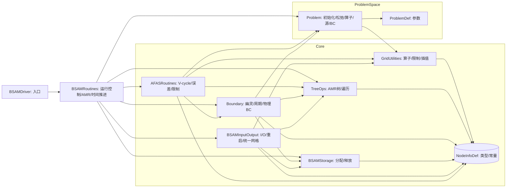

# BSAM 2.0 代码总览

## 一、项目目标与整体思路

- 该代码实现了基于块结构 AMR（自适应网格细化）的 AFAS（Adaptive Full Approximation Storage）多重网格求解框架，面向二维与三维 PDE（本问题示例为肿瘤生长模型/相场类方程的隐式时间推进）。
- 采用 cell-centered（CC）与 face-centered（FC）混合存储：q 为 CC 场（多分量），v1/v2/v3 为 FC 场；存在 coarse-under-fine（CUF）拷贝（qc、v1c 等）以支持跨层插值/限制与粗网校正。
- 关键流程：树结构与遍历（TreeOps） → 网格存储/分配（BSAMStorage） → 边界与幽灵单元处理（Boundary） → 传输算子与离散算子（GridUtilities） → 多重网格 V-cycle 调度（AFASRoutines） → I/O（BSAMInputOutput） → 问题特定算子/松弛（Problem, ProblemDef） → 驱动（BSAMRoutines/BSAMDriver）。

## 二、逐文件作用与逻辑

说明格式：文件/模块名；核心职责；主要数据结构与重要过程；与其他模块的依赖与调用；涉及的数值计算概念与编程技法。

### Fortran/LIBRARY/nodeinfodef.f90（模块 NodeInfoDef）

- 职责：全局常量/参数/开关与核心数据结构定义。包含网格块的派生类型 nodeinfo（网格维度、边界、dx、时间戳；CC/FC 各类物理量与旧值、副本、残差、源项、辅助量、截断误差 qrte；错误标记；leveLandscape；链表与临时结构等）。
- 数据结构：
		- nodeinfo：聚合所有该块需要的数组（带幽灵层）；fieldsallocated/activegrid/initialgrid/tobedeleted 等生命周期标志；mglobal/mbounds/mx/mthbc/level 等几何与层级信息。
		- uniformgrid、taggedcell、masscorrlayer 等辅助类型。
- 依赖：几乎被所有模块 use。
- 数值与技法：
		- CC/FC 分离的网格布局，FC 在各方向上偏移半格并含不同的幽灵层形状。
		- 存放 coarse-under-fine 拷贝（qc、v1c 等），便于限制/插值与粗网加载修正。

### Fortran/LIBRARY/bsamstorage.f90（模块 BSAMStorage）

- 职责：nodeinfo 级别的内存分配与释放；周期性边界偏移存储；统一网格缓冲。
- 主要过程：
		- AllocFields(info[, parent]) / DeAllocFields(info)：按 ndims 和 mbc 分配/释放 CC/FC 以及旧值、残差、源项、辅助等指针数组；设置 fieldsallocated 标志与幽灵层边界；在 3D/2D 下分别构造合适的数组切片。
	- Alloc/DeallocPeriodicBCStorage：periodicoffsetindex/poffset 的分配与释放，用于周期性映射。
	- Alloc/DeallocUniformGrids：多层级 uniformgrid(level)%q 的分配与释放（用于重启或统一网格输出）。
- 依赖：NodeInfoDef。
- 数值与技法：
		- 明确 CC/FC 网格形状与幽灵层大小，保证插值/限制时索引窗口正确。
		- 解耦生命周期管理，便于 AMR 动态建网与垃圾回收。

### Fortran/LIBRARY/gridutilities.f90（模块 GridUtilities）

- 职责：通用离散算子与跨层传输算子。
- 主要过程：
		- CC 算子：ULap2D/3D（未除以 h^2 的离散拉普拉斯）、UDiv2D/3D（未除以 h 的散度）、UDivPhi3D（phi*velocity 的对流通量散度）。
	- 限制（Restriction）：CC 的 Restriction2D/3D；FC 的 Restriction2DV1/V2 和 3DV1/V2/V3，保证面通量守恒。
	- 插值（Prolongation）：Prolongation2D/3D（注入/线性插值）；二维双线性/质量修正 BiLinProlongation P1/P2 与 P1MC/P2MC；三维三线性/质量修正 TriLinProlongation P1/P2 与 P1MC；FC 插值的 Ex 变体支持带幽灵层输入。
- 依赖：NodeInfoDef。
- 数值与技法：
		- 采用“未除以网格尺度”的算子，有利于在不同层级下共享核并将尺度因子集中放在调用处。
		- 质量修正插值在 AMR/多重网格的粗细一致性与质量守恒上更稳健。

### Fortran/LIBRARY/treeops.f90（模块 TreeOps）
- 职责：AMR 树结构的创建、遍历、层级/邻接维护以及 info 访问。
- 主要过程：
	- InitForest/CreateChild/KillNode/KillForest；ApplyOnForest/ApplyOnLevel/ApplyOnLeaves/ApplyOnLevelPairs/ApplyOnMyLevelNbrs 等遍历 API；SetLevelNodeNumbers。
	- GetRootInfo/GetParentInfo/GetChildInfo/GetCurrentNode/SetCurrentNodeInfo 等访问器；PushForest/PopForest 维护遍历上下文。
- 依赖：NodeInfoDef。
- 数值与技法：
	- 层级链表与“youngest/eldest on level”机制支持多遍历模式（对同层邻居通信尤为关键）。

### Fortran/LIBRARY/boundary.f90（模块 Boundary）
- 职责：幽灵单元填充（粗细过渡插值、同层块间对拷、周期性映射）与物理边界条件委托。
- 主要过程：
	- SetGhost(level, ipass)：调度一次完整的幽灵处理流水线：粗-细插值（InterpolateCoarseFine 2D/3D，包含 CC 与边/面量）、同层重叠区交换（GhostOverlap/GhostOverlapOneWayFC）、周期性就地/跨块（SelfPeriodicBC/TransferPeriodicBC），最后 SetPhysicalBC 调用 Problem::UserBC2D/3D。
	- PeriodicSetup/GetPeriodicOffsets：预计算周期偏移集合，便于映射。
	- GetCoarseGhostPoints：从 parent 填充 qc/v#c 的粗层幽灵面。
- 依赖：TreeOps（遍历）、GridUtilities（在部分插值中）、Problem（UserBC）。
- 数值与技法：
	- 红黑松弛与幽灵更新交替，保证 stencil 数据可用并提升收敛。
	- FC 一向传边界同步（TransferBCOneWayFC）避免双向覆盖冲突。

### Fortran/LIBRARY/bsaminputoutput.f90（模块 BSAMInputOutput）
- 职责：多层级 patch 数据输出与重启读入；统一网格输出。
- 主要过程：
	- WriteQ/OutputQ（2D/3D 变体）：逐层输出 q（并对 v1/v2/v3 做中心到单元的平均输出）。
	- ReadQ：按存档格式读入，校验 ndims/refinement=2，一边创建子网格一边 AllocFields 并回填数据；用于重启。
	- WriteUniformMeshQ：在每一层分配 uniformgrid(level)%q，通过从粗到细的 prolongation 和 patch-to-uniform 拷贝合并为单一层级输出。
- 依赖：TreeOps、BSAMStorage、GridUtilities、NodeInfoDef。
- 数值与技法：
	- 重启时先在 rootlevel 读入，再按文件描述递归构树，确保层级一致性。

### Fortran/LIBRARY/afasroutines.f90（模块 AFASRoutines）
- 职责：AFAS 多重网格外循环、V-cycle 递归、误差计算、限制/校正、源项/辅助项准备等。
- 主要过程：
	- MultigridIterations：组织一次时间步或同步阶段内的多次 V-cycle。调用 GetSourceFunction/UpdateSourceFunction/FillDown(sourcefield)；每次 V-cycle 后 ErrorAFAS 计算 L2 残差（CC/FC），达到阈值提前退出。
	- AFASVcycle(level)：LevelRelax（红黑松弛：RelaxPatchCC 与 RelaxPatchFC 交替；每次 pass 后 SetGhost）；若 level>minlevel，则 RestrictSolution 到父层，父层 SetGhost/GetCoarseGhostPoints 和 GetCoarseLevelLoading（可带质量修正），递归到更粗；回到细层后 CorrectFine 校正并再做 LevelRelax。
	- FillDown/RestrictSolution：父子层间 CC/FC 的限制/下传；FC 使用专门的 pull/push 同步与同层交换。
	- GetCoarseLevelLoading/CoarseLoadingFunctionCC/CoarseLoadingCorrection：从子层残差与父层算子构造粗层“负载”f，必要时计算质量校正层（边界条带）。
	- ErrorAFAS/L2Error/L2ErrorFC/L2ComponentErrors：各类 L2 指标。
- 依赖：TreeOps、Boundary、GridUtilities、Problem、NodeInfoDef。
- 数值与技法：
	- 采用 FAS（全近似存储）而非仅误差校正，适应非线性问题。
	- 红黑 Gauss-Seidel 松弛与 FC 同层单向交换结合，确保面量一致。

### Fortran/LIBRARY/bsamroutines.f90（模块 BSAMRoutines）
- 职责：高层运行控制与 AMR 管理（时间推进、构网/重构、I/O、统计）。
- 主要过程：
	- BSAMSolver：读取 rundata.dat，InitForest/RootInit/InitSeed，SetupProblem；根据 restart 选择读档或初始化；SetGhost/SetAux/SetSrc/CopyQToQold；进入 TakeTimeSteps。
	- TakeTimeSteps：外层帧循环与内层步推进；每步先将旧网格置为 inactive，调用 AMR(level) 重构网格并转移数据，删除旧网格；若首步，FillDown(solutionfield) 同步粗层旧值；保存 qold；根据设置输出初始数据；调用 MultigridIterations 做 V-cycle；更新 currenttime；可计算 AfterStepStatistics；设置每层 gridtime；达到 itperprint 写帧（WriteQ/WriteUniformMeshQ）。
	- AMR(level)：SetGhost；FindMeshDefects（确保最多一层悬挂点）；EstimateLevelErrors（基于 qrte 或用户策略，生成 tagged cells 并按 buffer 膨胀；考虑周期偏移）；GridAdapt 调用 RefineGrid 与 ApplyOnLevelPairs 进行新旧同层值迁移；必要时递归。
	- RootInit/InitSeed/MakeNewGrid/InitFields：读 griddata.dat，检查参数合法性，构建 root 与 seed；按 Berger-Rigoutsos 签名算法生成子块；为新块分配并通过质量修正的双/三线性插值初始化（FC 使用 Ex 变体）。
	- 其它：统计输出、网格信息打印、资源释放（ReleaseInactiveFields/ActiveFields、KillForest、DeallocPeriodicBCStorage）。
- 依赖：AFASRoutines、Boundary、GridUtilities、TreeOps、BSAMInputOutput、BSAMStorage、Problem。
- 数值与技法：
	- Berger-Rigoutsos 改进签名/拐点分裂法生成高覆盖率子块，按偶数对齐满足 r=2 细化。
	- 跨网格同层数据转移通过 mglobal overlap 计算统一区间，然后局部坐标映射拷贝。

### Fortran/LIBRARY/bsamdriver.f90（程序 BSAMDriver）
- 职责：入口程序。计时并调用 BSAMRoutines::BSAMSolver。

### Fortran/PROBLEM/3D Tumor Growth/problemdef.f90（模块 ProblemDef）
- 职责：问题参数定义（物理、数值系数），例如 alpha/eps/gamma/mu 等，以及 pp, AA, Zeta, epep, DtDh, MD 等；并派生常量组合（如 epep2）。
- 依赖：NodeInfoDef（r8）。

### Fortran/PROBLEM/3D Tumor Growth/problem.f90（模块 Problem）
- 职责：问题特定逻辑，包括：初始化 Initialize2D/3D；多重网格所需的 RelaxGrid2D/3D 与边/面 RelaxGrid2DEdge/3DEdge（部分留空或示意）；算子 Operator2D/3D 和 FC 方向算子（部分模板）；源项 Source2D/3D 与更新 SourceUpdate2D/3D；误差标记 SetErrFlagsUser2D/3D；物理边界条件 UserBC2D/3D；以及若干元素函数（Mob/MobD、Fof、fof1/fof2、Sqr/Cube 等）。
- 数值与技法：
	- 时间离散采用类似 Eyre 梯度稳定策略（部分项显式/半隐式分裂），配合 V-cycle 红黑松弛在网格上逐点解 2x2 小系统。
	- 移动性 M(c) 与其变体 MobD(c) 控制扩散项，存在正定性与稳定性考虑。
	- 用户边界条件实现剪切流等情形，FC 边值取对称/反射或设零，CC 第三分量（如化学势）采取镜像 2.0 - q 等特殊处理以满足物理要求。

### Fortran/PROBLEM/3D Tumor Growth/makefile
- 职责：以 gfortran 编译为默认（支持 MODF/OF 输出目录），列出编译顺序与依赖；目标为 xbsam。

## 三、总体架构关系（Mermaid 图）
注意：以下是模块级数据流/调用关系草图。

